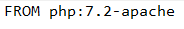
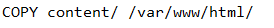
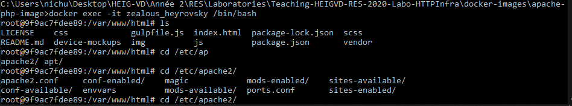
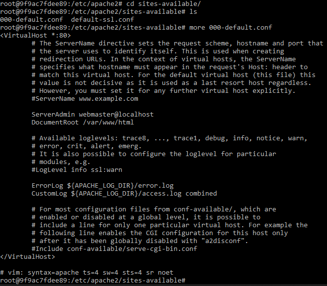

##Step 1

### Acceptance criteria

1. You have a GitHub repo with everything needed to build the Docker image.
2. You can do a demo, where you build the image, run a container and access content from a browser.
3. Building the image in the directory containing the Dockerfile :
    * docker build -t <nom_image> .
4. Running the container with the port mapping.  
    * docker run -p <localport:portContainer> <nom_image> 

5. Access content from a web browser
    * Writing in the URL <localhost:localport> to be able to access the content.

6. You have used a nice looking web template, different from the one shown in the webcast.
7. You are able to explain what you do in the Dockerfile.

    * We use a already created image called php:7.2-apache

    

    * Every time we run a container, all the content and all the files in the content/ directory will be copied in the var/www/html/ directory of the container.
 This container directory is the default root directory configured in etc/apache2/sites-enabled directory.

    

8. You are able to show where the apache config files are located (in a running container).

    * We exec an interactive image with a bash client to travel in the filesystem. In the etc/apache2/ we can find these files.

    

    * There are all the differents virtual hosts. We are interested in the default one in **sites_available**. We can then open the .conf file inside to know more about the virtual host.

    

9. You have **documented** your configuration in your report.