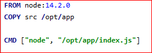
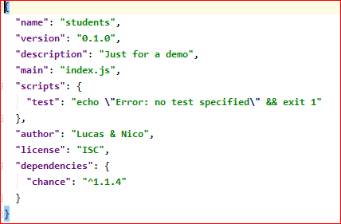
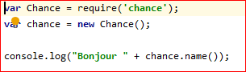
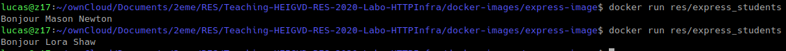
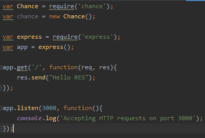
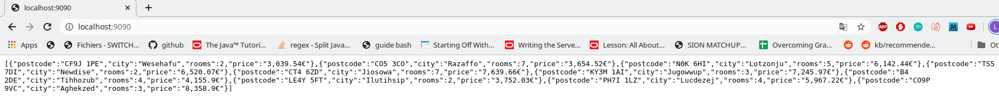
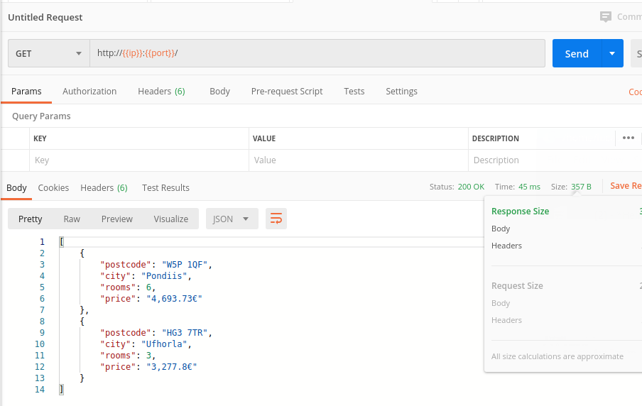

 ##Step2
 
 1. You have a GitHub repo with everything needed to build the Docker image.
 2. You can do a demo, where you build the image, run a container and access content from a browser
    * Here is our Dockerfile :
    
    This time we copy our src directory in /opt/app because we want to copy an app
     and not html content like we did in step1.
     CMD is a command that will be run by the container every time we run it. So every time we run the container it will
     do "node /opt/app/index.js".
     * In our src directory we used npm to create a package.json file with the command npm init. 
     * Then we used **npm install --save chance** to install the package chance and any of its dependencies and to save it/them.
      The command also updates our package.json file, so now we have an dependencies entry with chance in it.
     
     * Chance gives us a lot of functionality to generate random datas. So now that we have it installed we can create
     our **index.js** file that will be run by node every time we run this container.
     
     * To build the container's image we go in the directory containing the Dockerfile and run this command : 
     **docker build -t res/express_students.png .** . Then we run the container with **docker run res/express_students.png**
      We can see that our index.js file is correctly executed.
3. You generate dynamic, random content and return a JSON payload to the client.
    * installing express into the directory :
        * npm install --save express
       
   * added some code in index.js 
        * a port listener fonction **listen();**
        * a callback function **get();**
        * express with **var express = require('express');**
        
    
        
    * To give access outside of Docker we run it with the option -p (port mapping)
        * docker run -p 9090:3000 express_students
    
4. You cannot return the same content as the webcast (you cannot return a list of people).

    

    Nous avons également testé avec avec la nouvelle fonctionnalité postman
    
    

5. You have **documented** your configuration in your report.
