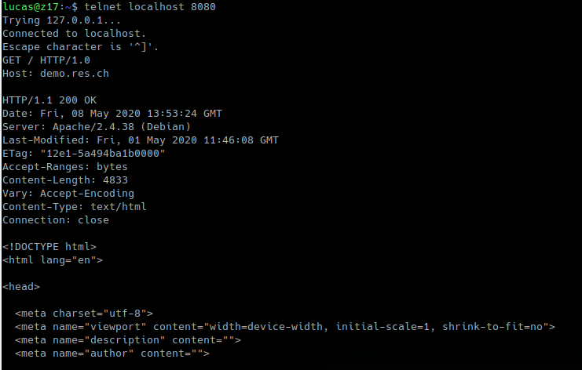

 ##Step3
 
1. You have a GitHub repo with everything needed to build the Docker image for the container.
2. You can do a demo, where you start from an "empty" Docker environment (no container running) and where you start 3 containers: static server, dynamic server and reverse proxy; in the demo, you prove that the routing is done correctly by the reverse proxy.

    * First we start our 2 container (express and apache) in the background with this command:
        * docker run -d --name <container_name> <image_name>
        
    * We inspect both container to know which address they use 
        * docker inspect <container_name> | grep -i ipaddress
        
    * Once we've done that, we can run interactively the proxy image from the apache one with a console and manage de port mapping with :
        * docker run -it -p 8080:80 php:7.2-apache /bin/bash
        
    * From this console we can go in the configuration directory (etc/). We create a new config file for the proxy server where we change the host and add ProxyPass
    
        
        ProxyPass = when the request arrives 
        ProxyPassReverse = when the response is send to the client
        If the request adds /api/students/ we redirect on the 172.17.0.3:3000. If he did not found anything ot will redirect to 172.17.0.2:80
        
     * We connected with telnet to localhost 8080 and sent a request :
        
        
        It is not working ebcause we forgot to add the host to the request (we added Servername in the proxy config file)
        
     * We tried both possibilities (with /api/students/ and with nothing) and these are the results :
     
        
        
        

3. You can explain and prove that the static and dynamic servers cannot be reached directly (reverse proxy is a single entry point in the infra). 

    On linux, the "docker host" runs directly on the computer OS, so the servers can be reached directly. To prove that the proxy is working we would need to try to reach the servers on another machine in the same network. On windows/mac the "docker host" runs in a vm, so we can try to reach the servers from outside of the docker-machine environment.

4. You are able to explain why the static configuration is fragile and needs to be improved.

    Our static configuration needs to be improved because the ipaddress of the containers are "hard coded". Which means that the config file needs to be updated with the right apadress avery time we run the apache-static & the express-dynamic containers
    
5. You have documented your configuration in your report.
