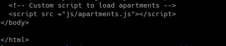
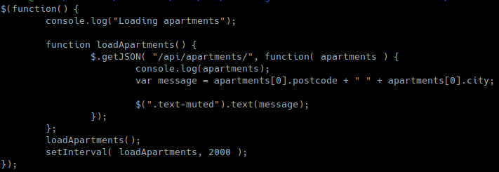
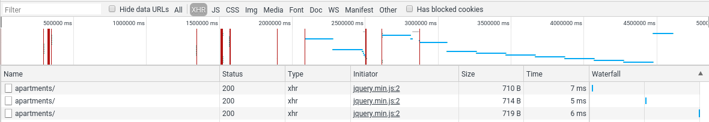
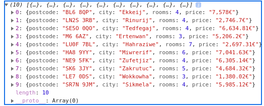

 ##Step4
  
 1. You have a GitHub repo with everything needed to build the Docker image for the container.
 2. You can do a complete, end-to-end demonstration: the web page is dynamically updated every few seconds (with the data coming from the dynamic backend). 
 
    In this step we have created a js script to dynamically update a part of our apache static web server.
    
    First we have modified the *index.html* of our *apache-php-image*  (apache-php-image/content/index.html). We added a line that referr our script at the end of the file :
   
    
    
    Then we created our script (apache-php-image/content/js/apartments.js) :
    
    
    
    The script get the first dynamic data generated by our dynamic web server and place it in our static web server.
    The text of elements of classes *text-muted* are replace by the dynamic data.
    
    
    
    And is updated every 2000 ms (*setInterval( loadApartments, 2000 )*).
    
3. You are able to prove that AJAX requests are sent by the browser and you can show the content of the responses.

    We can see that AJAX requests are sent periodically :
    
    
    
    Here is the content of the responses, in our script we only use the first cell of the array :
    
    
    
4. You are able to explain why your demo would not work without a reverse proxy (because of a security restriction).
    
    No we aren't able to.
    
    The reverse proxy knows the ip adresses of the 2 others containers. So when our js script calls the function
    loadApartments(), it will be able to resolve the access to /api/apartments and get the dynamic data.
    Without the proxy the /api/apartments wouldn't be accessible by the script and therefor it wouldn't work.
    
 5. You have documented your configuration in your report.
   