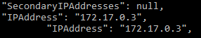

##Step 5

1. You have a GitHub repo with everything needed to build the various images.
2. You have found a way to replace the static configuration of the reverse proxy (hard-coded IP adresses) with a dynamic configuration.
3. You may use the approach presented in the webcast (environment variables and PHP script executed when the reverse proxy container is started),
 or you may use another approach. The requirement is that you should not have to rebuild the reverse proxy Docker image when
  the IP addresses of the servers change.
5. You are able to explain how you have implemented the solution and walk us through the configuration and the code.
         
     We have modified our startup script so we can invoke the php interpretor and inject environment variables in a php template
     in order to dynamically configure the reverse-proxy. With this configuration we can start the container and give it ipaddresses instead of
     having them hardcoded in the config file inside the container.
     
     If we check the Dockerfile of the apache image we are using : *https://github.com/docker-library/php/blob/master/7.2/buster/apache/Dockerfile*
     We can see at the end of it that the *CMD ["apache2-foreground"]* is used in order to start apache in fore-ground (instead of background which is normally done) 
     and not to end the container immediatly.
     A few line earlier we notice that they copy the apache2-foreground script into /usr/local/bin/, we will use the same technique to create
     our script. 
     
     We copied the *apache2-foreground* file they were using and added our script in it (*https://github.com/docker-library/php/blob/master/7.2/buster/apache/apache2-foreground*)
     
     
     
     We first display the environment variables that should be passed to the container, then we execute the php script and store its results
     in the reverse-proxy config file.
     
     Then in our *Dockerfile* we have to copy our *apache2-foreground* in the container as they did.
     
     
     
     Now we will use php to create a template for the reverse-proxy config file. We have to adapt the Dockerfile to copy
     the template into the container so the script can use the template (image above).
     
     Here is our template :
     
     
     
     This template gets the 2 env variables that should be passed to the container in order to replace the ipaddresses in the urls.
     
     In a nutshell when we run the container we have to pass it 2 environment variables that correspond to the ipaddresses
     of our dynamic and static web servers.
     During the creation of the container our script in apache2-foreground will be executed and it will create our reverse-proxy configuration
     file with the ipaddresses we gave it.
     
     
     
4. You are able to do an end-to-end demo with a well-prepared scenario. Make sure that you can demonstrate that everything works fine when the IP addresses change!

    1. First of all, you have to build all the images.
        * docker build -t <image_name> .
    2. Start the static and the dynamic containers with the option _-deamon_.
        * docker run -d <image_name>
    3. Now we need to know which address the containers are using, we use this command.
        * docker inspect <image_name> | grep -i ipaddr
        
        
      
    4. With these two addresses, we can run the proxy server container with the -e option allowing us to add
        environment variable. We will add two of them with the ip addresse and the port number of our containers.
        Don't forget to do the port mapping as well.
        * docker run -d -e STATIC_APP=<ipaddr1> -e DYNAMIC_APP=<ipaddr2> -p  8080:80 <image_name>
        
    5. To control the last point, we can use the command logs on the proxy server container to see if the
        environment variables are the correct ones. This works because we added echo command in the config script.
        * docker logs <image_name>
        
        

5. You have documented your configuration in your report.