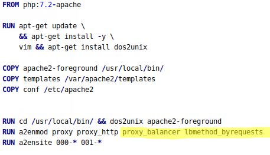
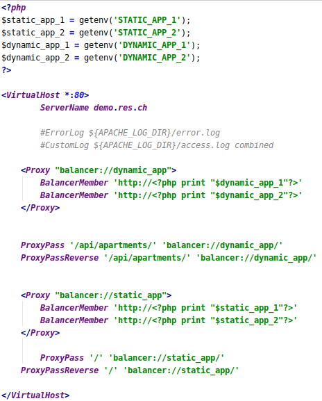
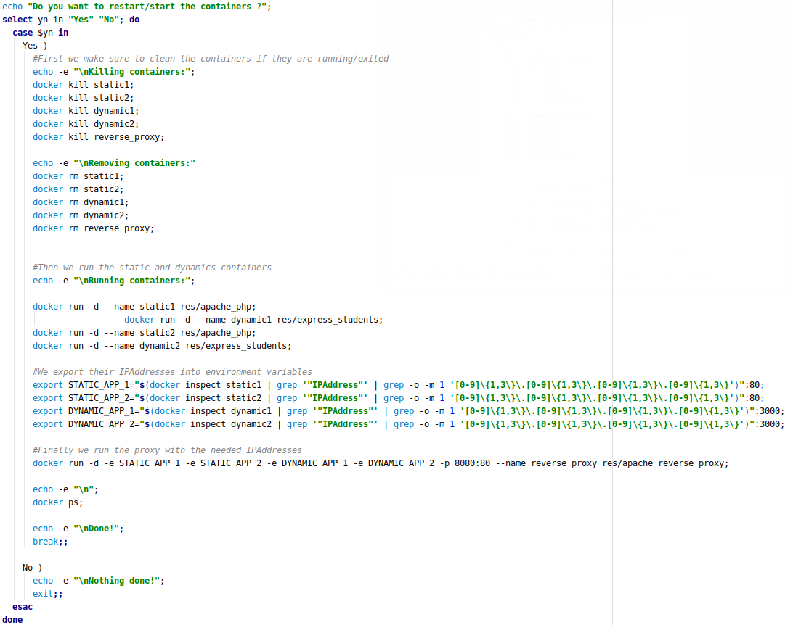
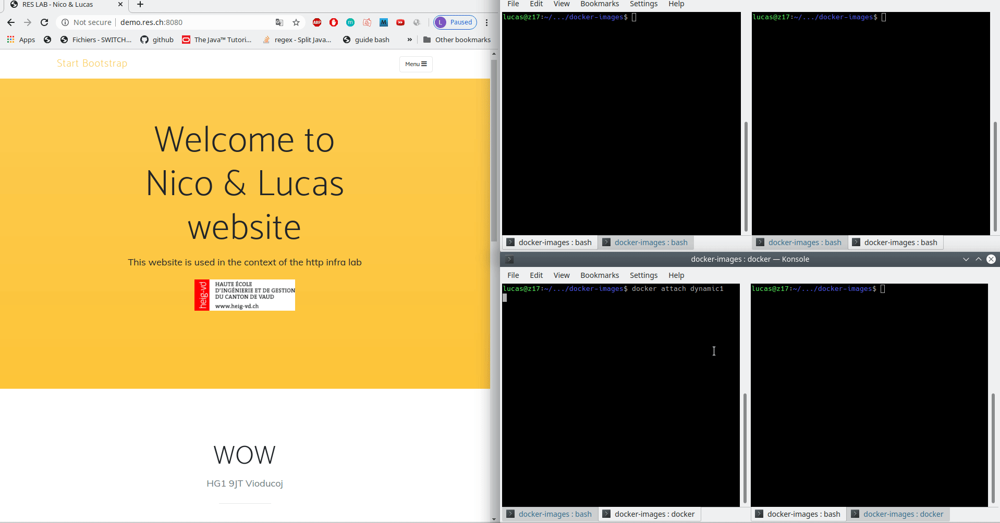

## Step Load Balancer

1. You extend the reverse proxy configuration to support load balancing.

    Apache has an extension for load balancing : **mod_proxy_balancer**
    
    It provides load balancing for *HTTP* and others protocols.
    
    There are 4 load balancer scheduler algorithms availabe, we chose the one called
    *Request Counting*. Another module is requested for this algorithm to work : **mod_lbmethod_byrequests**
    
    We modified our Dockerfile to enable those 2 mods :
    
    
    
    We modified the config-template.php to allow load balancing on our proxy server
    
    
    
    We have two balancers, one for the static server and one for the dynamic server.
    Each BalancerMember is a server node.
    
    
2. You show that you can have multiple static server nodes and multiple dynamic server nodes.

    We could add other nodes to each balancer by adding BalancerMembers and provide his IPAddress:Port with environment
    variables.
    
    Then when we run the reverse-proxy container we pass it the environment variables with the -e option.
    
    We wrote a script **run_containers.sh** that will kill, remove and then run the 4 differents nodes, and then run
    the reverse-proxy container.
    
    
    
3. You prove that the load balancer can distribute HTTP requests between these nodes.

    
    
4. You have documented your configuration and your validation procedure in your report.