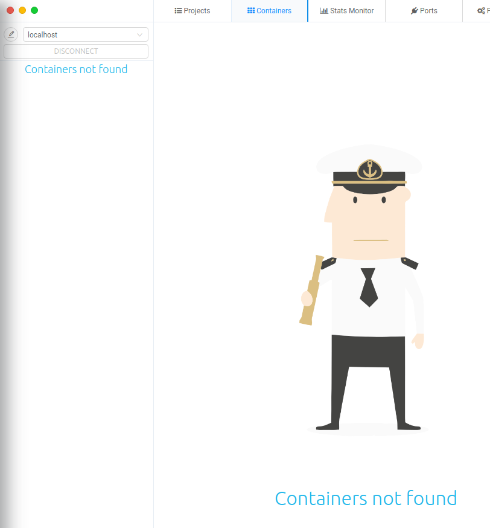
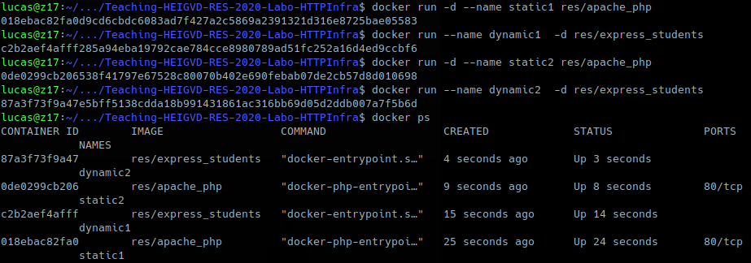
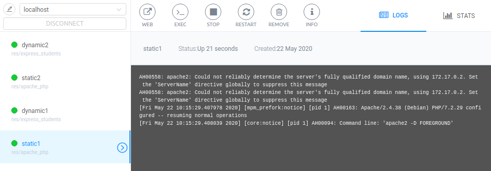
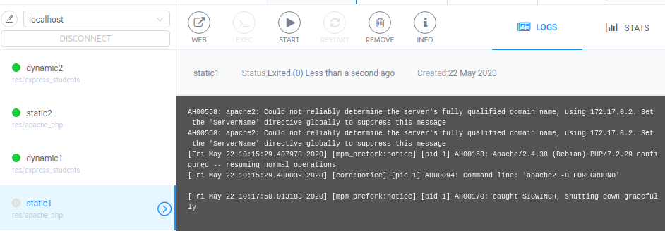
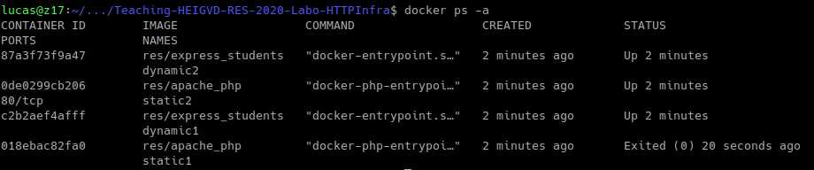
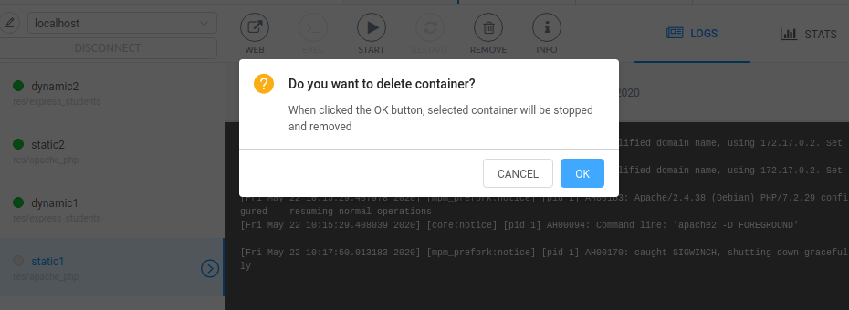
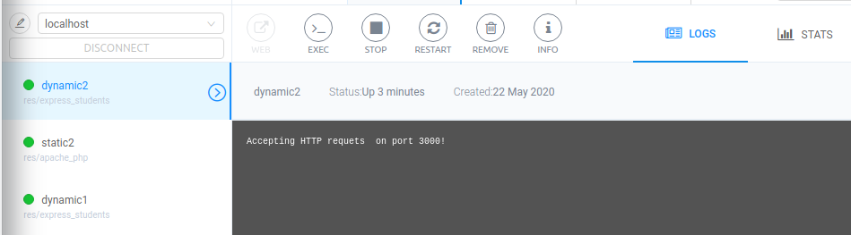
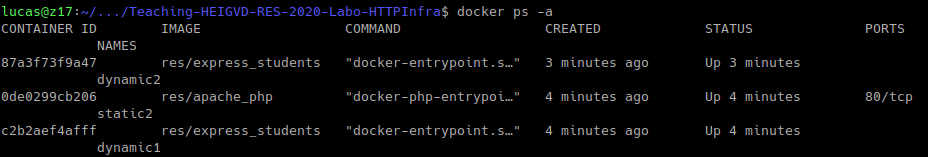

## StepManagementUI

We chose to use a software which will be our GUI to manage docker.

We use dockstation (www.dockstation.io):

To see how it works we just have to open the software and to start some containers with CMD. Dockerstation will allows us
to see them, to stop or to restart them.

Here is the software when there are no container actually running and no container were run.

then we started a few containers

We can stop container throught hte GUI with the button **stop**:

We can delete the container as well with the button **remove**:

There is the possibility to execute container in interactiv mode with the button **exec**, or to restart a container with
the button **restart** and so on...

