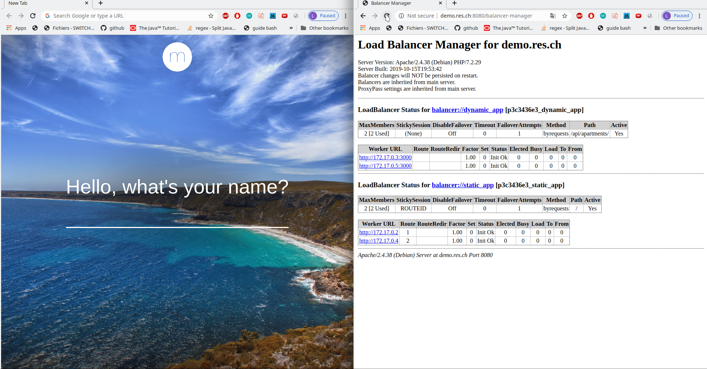
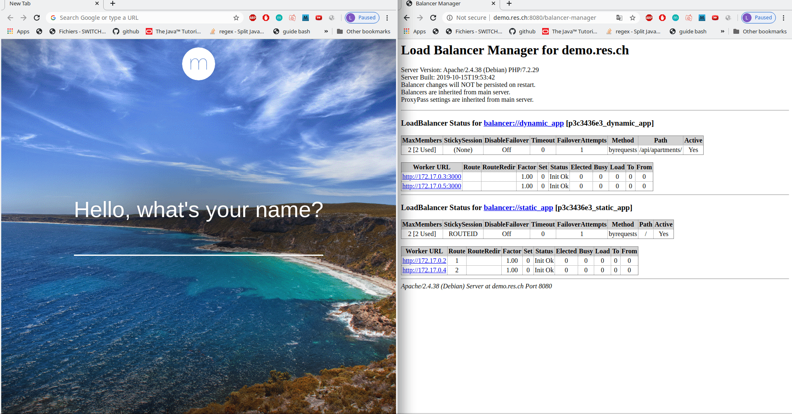

You do a setup to demonstrate the notion of sticky session.
You prove that your load balancer can distribute HTTP requests in a round-robin fashion to the dynamic server nodes (because there is no state).
You prove that your load balancer can handle sticky sessions when forwarding HTTP requests to the static server nodes.
You have documented your configuration and your validation procedure in your report.

We use two news apache extensions to have a balancer-manager and a sticky-session: *mod_status* & *mod_headers*.
We modified our Dockerfile to enable those two modes:
    
    FROM php:7.2-apache
      
    RUN apt-get update \
        && apt-get install -y \
            vim && apt-get install dos2unix
    
    COPY apache2-foreground /usr/local/bin/
    COPY templates /var/apache2/templates
    COPY conf /etc/apache2
    
    
    RUN cd /usr/local/bin/ && dos2unix apache2-foreground
    RUN a2enmod proxy proxy_http proxy_balancer lbmethod_byrequests headers status
    RUN a2ensite 000-* 001-*

And then we modified the config-template to configure the balancer-manager and the sticky session on our static members:

    <?php
    $static_app_1 = getenv('STATIC_APP_1');
    $static_app_2 = getenv('STATIC_APP_2');
    $dynamic_app_1 = getenv('DYNAMIC_APP_1');
    $dynamic_app_2 = getenv('DYNAMIC_APP_2');
    ?>
    
    <VirtualHost *:80>
            ServerName demo.res.ch
    
            #ErrorLog ${APACHE_LOG_DIR}/error.log
            #CustomLog ${APACHE_LOG_DIR}/access.log combined
    
    
            <Proxy "balancer://dynamic_app">
                    BalancerMember 'http://<?php print "$dynamic_app_1"?>'
                    BalancerMember 'http://<?php print "$dynamic_app_2"?>'
            </Proxy>
    
    
            ProxyPass '/api/apartments/' 'balancer://dynamic_app/'
            ProxyPassReverse '/api/apartments/' 'balancer://dynamic_app/'
    
            Header add Set-Cookie "ROUTEID=.%{BALANCER_WORKER_ROUTE}e; path=/" env=BALANCER_ROUTE_CHANGED
            <Proxy "balancer://static_app">
                    BalancerMember 'http://<?php print "$static_app_1"?>' route=1
                    BalancerMember 'http://<?php print "$static_app_2"?>' route=2
                    ProxySet stickysession=ROUTEID
            </Proxy>
    
            ProxyPass '/' 'balancer://static_app/'
            ProxyPassReverse '/' 'balancer://static_app/'
    
            <Location '/balancer-manager'>
                    ProxyPass !
                    SetHandler balancer-manager
            </Location>
    </VirtualHost>
    
So now everytime a static node will be accessed a cookie of name ROUTID with the value of the static
node route will be assigned to the accessor.

To prove that our load-balancer is providing http requests in a round-robin fashion to the dynamic nodes we can
observe the colum *Elected* of our dynamic workers in teh balancer-manager interface (demo.res.ch:8080/balancer-manager).
And we can see that the dynamic node responding changes every request that are sent.

To prove that our load-balancer can handle sticky sessions when forwarding HTTp requests to the static nodes, we access
demo.res.ch:8080 and reload the page several times. We will see that it is always the same static node that will respond due 
to the cookie. If we delete the cookie and then reload the page, the responding static node could change.

If the current static node is shut down, the http request will be sent to the other node despite the fact it had a sticky-session
with the shut down node.

